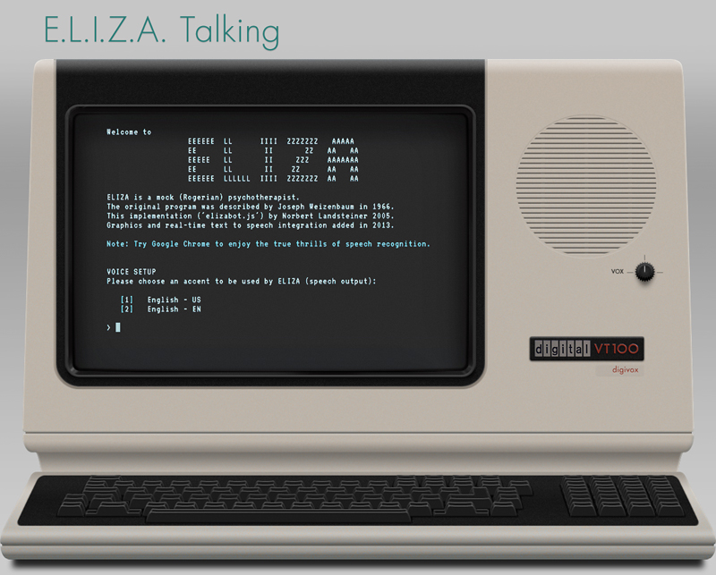
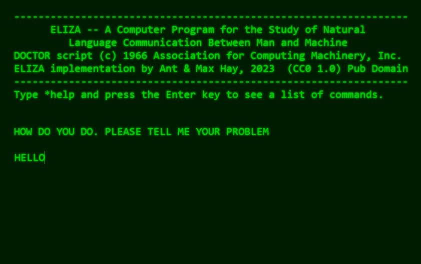
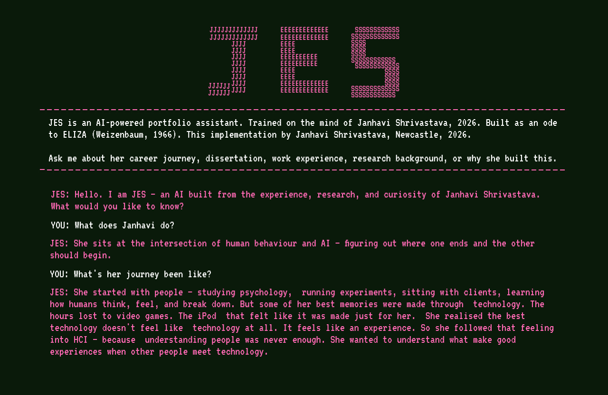
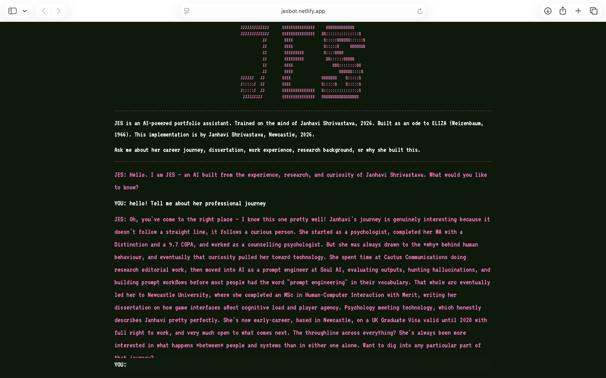

# JES — AI Portfolio Assistant

**[Talk to JES live →](https://jesbot.netlify.app)**

---

## So what is this?

When I was 13, I found a program called ELIZA on my family computer. My elder cousin controlled the computer, so we only had a small window of time on it after school. One day, bored after a game, I clicked on this strange icon and started talking to it.

The computer talked back.

I asked it everything. Who are you? Where are you from? What do you look like? The kind of questions you ask when you forget you are talking to a computer from 1966. It answered, sort of. But something felt off. I quickly noticed it was recycling the same phrases, taking my words and paraphrasing them back in odd ways. "Have you always felt this way?" "Are you sure?"

So naturally, I tried to break it.

I spent that afternoon throwing increasingly unhinged prompts at ELIZA to find the cracks. I was 13. I did not know it at the time, but that was my first experience of prompt engineering.

ELIZA was not really an AI. It was a rule-based chatbot from MIT, 1966, with no real understanding whatsoever. But it started something in me that never really went away.

So when I decided to build a portfolio assistant, I thought - what better way to show how much I love AI than to turn myself into one? JES is my ode to ELIZA. Same aesthetic. Very different brain underneath.

---

## The Inspiration — ELIZA (1966)

The aesthetic is a deliberate tribute to the world ELIZA came from: 1960s and 70s CRT terminals.

---

## The Design Process — Figma

I designed the UI in Figma before building anything. Every choice intentional:

- Background: `#0A1A0A` forest green
- JES responses: `#FF69B4` magenta
- User input: `#FFFFFF` white
- Font: VT323 (Google Fonts) - the most authentic CRT terminal feel
- Dashed pink dividers
- Scanline overlay
- Blinking block cursor
- Typewriter effect on JES responses
---

## The Final Product

**[Try it live at jesbot.netlify.app →](https://jesbot.netlify.app)**

---

## Why "JES"?

My initials are JS. Say them fast enough and you get Jes. It started as a nickname my school best friend and I came up with, without putting a lot of thought into it. And Jes stuck around. She is my alter ego - the bolder, more confident, more get-it-done version of me. When it came to building an AI that would represent me to the world, who better to be than Jes?

---

## How it works

- Frontend: vanilla HTML, CSS, JavaScript - one single file, no frameworks
- AI: Claude Sonnet 4.6 via Anthropic API
- Hosting: Netlify
- The system prompt is where the real work is - it trains JES on my background, experience, projects, personality, and the stories behind all of it

---

## A note on building with AI

I built this using Claude as a coding assistant. I came up with the concept, designed the UI in Figma, wrote the entire system prompt, and made every product and design decision along the way. Claude handled the implementation.

Honestly, using AI as a tool to actually build something felt like the most fitting way to make this. I did not want to just talk about loving AI. I wanted to show it.

---

## Built by

**Janhavi Shrivastava**
MSc Human-Computer Interaction, Newcastle University
[jesbot.netlify.app](https://jesbot.netlify.app) · [shrivastavajanhavi1@gmail.com](mailto:shrivastavajanhavi1@gmail.com)
